# Bewertungen - Referenzobjekt Kunden

> Supplied customer source. Treat claims and copy as unapproved until verified.

Bewertung ETW - Schützengraben, Herzogenaurach - Verkäufer

Bewertung REH - Siebenbürger Straße, Nürnberg  - Verkäufer

Bewertung EFH - An den Hausäckern, Hagenbüchach - Verkäufer

Bewertung DHH – Wörnitz Straße  Nürnberg  / Verkäufer

Bewertung ETW – Abenberger Straße – Schwabach / Verkäufer

Bewertung ETW – Bürgermeister Keckl Str. Deining  – Verkäufer

Bewertung ETW – Stabiusstraße Nürnberg – Verkäufer

Bewertung ETW – Gutenbergstraße Zirndorf – Verkäufer

Bewertung ETW – Züricher Straße, Nürnberg – Verkäufer

Bewertung EFH – Seidelbastweg, Nürnberg – Verkäufer

Bewertung ETW – Ludwigstraße, Fürth – Verkäufer

Bewertung DFH – Am Vogelherd, Heroldsbach – Verkäufer

Bewertung ETW – Luise Kiesselbach Straße, Erlangen – Verkäufer

Bewertung RMH – Reuthseering, Adelsdorf – Verkäufer

Bewertung MFH – Ottostraße, Fürth – Verkäufer

Bewertung ETW – Lenzenstraße, Langenzenn – Verkäufer

Bewertung ETW – Homburger Straße, Zirndorf – Verkäufer

Bewertung Medizinisches Versorgungszentrum, Fürth – Verkäufer

Bewertung ETW – Neutorgragen, Nürnberg – Verkäufer

Bewertung ETW – Kellermannstraße, Fürth – Verkäufer

Bewertung ETW – Marienbader Straße, Zirndorf – Verkäufer

## Embedded media

### Embedded image 1

- Package source: `word/media/image1.png`

- SHA-256: `c1dd6a78409d2ef65f39b7cfaa7a8e8c7edd83975b7e4bf4fe8a10848e96f37f`

- Size: 17547 bytes; 525x194 px

#### Visible-text transcription

- Content type: Google review screenshot

- Reviewer: Patric Mago

- Profile context: 5 Rezensionen · 6 Fotos

- Rating: 5/5

- Relative date: vor 3 Jahren

> Herr Karabacak und sein Team haben uns den Großteil der Arbeit abgenommen. Top Abwicklung und super Kommunikation. So sollte es sein.

### Embedded image 2

- Package source: `word/media/image10.png`

- SHA-256: `2dc73c11d3dce71f347953d04a5bfc480ff5718c42791cd85deb1880907fcad4`

- Size: 19354 bytes; 520x237 px

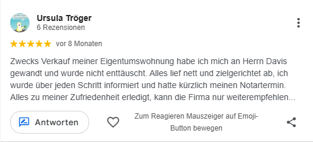

#### Visible-text transcription

- Content type: Google review screenshot

- Reviewer: Ursula Tröger

- Profile context: 6 Rezensionen

- Rating: 5/5

- Relative date: vor 8 Monaten

> Zwecks Verkauf meiner Eigentumswohnung habe ich mich an Herrn Davis gewandt und wurde nicht enttäuscht. Alles lief nett und zielgerichtet ab, ich wurde über jeden Schritt informiert und hatte kürzlich meinen Notartermin. Alles zu meiner Zufriedenheit erledigt, kann die Firma nur weiterempfehlen...

- Note: The screenshot visibly truncates the final sentence with an ellipsis.

### Embedded image 3

- Package source: `word/media/image11.png`

- SHA-256: `60e67804550901163fb58ace9359e6da019132ce3767c35cf58b1e4c5c7e1b16`

- Size: 33595 bytes; 509x513 px

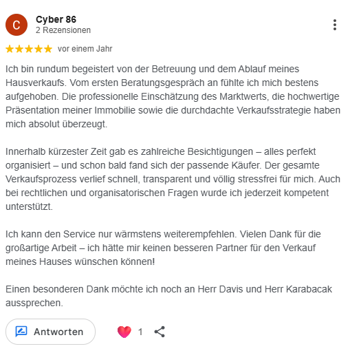

#### Visible-text transcription

- Content type: Google review screenshot

- Reviewer: Cyber 86

- Profile context: 2 Rezensionen

- Rating: 5/5

- Relative date: vor einem Jahr

> Ich bin rundum begeistert von der Betreuung und dem Ablauf meines Hausverkaufs. Vom ersten Beratungsgespräch an fühlte ich mich bestens aufgehoben. Die professionelle Einschätzung des Marktwerts, die hochwertige Präsentation meiner Immobilie sowie die durchdachte Verkaufsstrategie haben mich absolut überzeugt.
>
> Innerhalb kürzester Zeit gab es zahlreiche Besichtigungen – alles perfekt organisiert – und schon bald fand sich der passende Käufer. Der gesamte Verkaufsprozess verlief schnell, transparent und völlig stressfrei für mich. Auch bei rechtlichen und organisatorischen Fragen wurde ich jederzeit kompetent unterstützt.
>
> Ich kann den Service nur wärmstens weiterempfehlen. Vielen Dank für die großartige Arbeit – ich hätte mir keinen besseren Partner für den Verkauf meines Hauses wünschen können!
>
> Einen besonderen Dank möchte ich noch an Herr Davis und Herr Karabacak aussprechen.

### Embedded image 4

- Package source: `word/media/image12.png`

- SHA-256: `faed202514198db3e3cac869e2dd01a6ca685a32f7df74cc536a92afbcd862fa`

- Size: 11924 bytes; 522x175 px

#### Visible-text transcription

- Content type: Google review screenshot

- Reviewer: Ralf Henkel

- Profile context: 11 Rezensionen · 3 Fotos

- Rating: 5/5

- Relative date: vor 9 Monaten

> Sehr freundlich und professionell. Kann ich nur weiterempfehlen

### Embedded image 5

- Package source: `word/media/image13.png`

- SHA-256: `eeb4f7e6fa5de89844f90104f49465f6e0fb8849b2acaf25afa03e4846a479ea`

- Size: 17407 bytes; 524x233 px

#### Visible-text transcription

- Content type: Google review screenshot

- Reviewer: Christian Rock

- Profile context: 2 Rezensionen

- Rating: 5/5

- Relative date: vor 9 Monaten

> Erstklassige Betreuung, ab dem ersten Tag, perfekte Korrespondenz. Professionelles Auftreten, sehr freundlich, hilfsbereit, und fast immer jemand zu erreichen. Auch wenn der anvisierte Betrag nicht ganz erreicht wurde, aber das ist dem Markt geschuldet. Vielen Dank für die tolle Zusammenarbeit. 👍

### Embedded image 6

- Package source: `word/media/image14.png`

- SHA-256: `fa96910ee011ec2bc668f1d17b5db2be16208264761ab586aa040b0fd1d68869`

- Size: 12109 bytes; 516x212 px

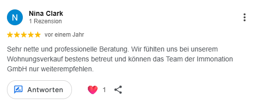

#### Visible-text transcription

- Content type: Google review screenshot

- Reviewer: Nina Clark

- Profile context: 1 Rezension

- Rating: 5/5

- Relative date: vor einem Jahr

> Sehr nette und professionelle Beratung. Wir fühlten uns bei unserem Wohnungsverkauf bestens betreut und können das Team der Immonation GmbH nur weiterempfehlen.

### Embedded image 7

- Package source: `word/media/image15.png`

- SHA-256: `6c503f39dc1ef1c693f3b17d89383cf094e9b5e5fd3abe6e1ea7a644604ee784`

- Size: 29301 bytes; 515x406 px

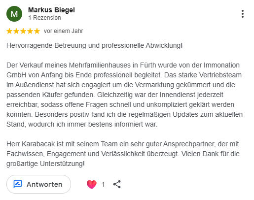

#### Visible-text transcription

- Content type: Google review screenshot

- Reviewer: Markus Biegel

- Profile context: 1 Rezension

- Rating: 5/5

- Relative date: vor einem Jahr

> Hervorragende Betreuung und professionelle Abwicklung!
>
> Der Verkauf meines Mehrfamilienhauses in Fürth wurde von der Immonation GmbH von Anfang bis Ende professionell begleitet. Das starke Vertriebsteam im Außendienst hat sich engagiert um die Vermarktung gekümmert und die passenden Käufer gefunden. Gleichzeitig war der Innendienst jederzeit erreichbar, sodass offene Fragen schnell und unkompliziert geklärt werden konnten. Besonders positiv fand ich die regelmäßigen Updates zum aktuellen Stand, wodurch ich immer bestens informiert war.
>
> Herr Karabacak ist mit seinem Team ein sehr guter Ansprechpartner, der mit Fachwissen, Engagement und Verlässlichkeit überzeugt. Vielen Dank für die großartige Unterstützung!

### Embedded image 8

- Package source: `word/media/image16.png`

- SHA-256: `30bc0ebc18a59a0e1801e012fadcbce7a79c1a0801349308fcc814ac3a990b7b`

- Size: 18711 bytes; 518x289 px

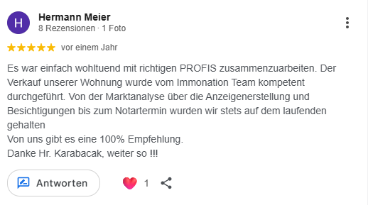

#### Visible-text transcription

- Content type: Google review screenshot

- Reviewer: Hermann Meier

- Profile context: 8 Rezensionen · 1 Foto

- Rating: 5/5

- Relative date: vor einem Jahr

> Es war einfach wohltuend mit richtigen PROFIS zusammenzuarbeiten. Der Verkauf unserer Wohnung wurde vom Immonation Team kompetent durchgeführt. Von der Marktanalyse über die Anzeigenerstellung und Besichtigungen bis zum Notartermin wurden wir stets auf dem laufenden gehalten.
> Von uns gibt es eine 100% Empfehlung.
> Danke Hr. Karabacak, weiter so !!!

### Embedded image 9

- Package source: `word/media/image17.png`

- SHA-256: `72f135658a1fc20b5061453cd5da71d5b399bc935e6fb8ecc2b4791d11fabd84`

- Size: 23871 bytes; 515x329 px

#### Visible-text transcription

- Content type: Google review screenshot

- Reviewer: Christian Hummel

- Profile context: 6 Rezensionen

- Rating: 5/5

- Relative date: vor 2 Jahren

> Wir sind absolut zufrieden! Trotz der angespannten Marktlage wurde das Objekt innerhalb unseres relativ kurzen Zeitrahmens und innerhalb der Wunschvorstellung verkauft.
> Herr Karabacak und sein Team sind absolut professionell aufstellt, schicken pro aktiv Reports, Updates und haben eine angenehme lockere Kommunikation. Auch die Exposé Erstellung und das Vermarkten war auf Top Niveau!
> Wir hatten 3-4 Maklergespräche und haben uns sofort für Immonation entschieden und würden es wieder tun 👍 Der Erfolg spricht für sich

### Embedded image 10

- Package source: `word/media/image18.png`

- SHA-256: `ecd490113fb36fea57e82712436bde122eaf3c766dbbe7dadf3b59f9ba9c4e5c`

- Size: 16345 bytes; 519x250 px

#### Visible-text transcription

- Content type: Google review screenshot

- Reviewer: Klaus Zöpfel

- Profile context: 1 Rezension

- Rating: 4/5

- Relative date: vor 2 Jahren

> Das war eine rundum gelungene Sache, alle Zusagen wurden eingehalten. Meine Immobilie wurde in schwierigen Umfeld zu einem zufrieden stellendem Preis verkauft. Die gesamte Kommunikation und Bearbeitung äußerst professionell. Ich kann das Unternehmen nur weiterempfehlen! Klaus W. Zöpfel

### Embedded image 11

- Package source: `word/media/image19.png`

- SHA-256: `e2f8e6b51638d6bc7d63139f21c182aca4f6ae808025b0dfbd19f9b0ca2f5516`

- Size: 12473 bytes; 523x204 px

#### Visible-text transcription

- Content type: Google review screenshot

- Reviewer: Andrea Streilein

- Profile context: 3 Rezensionen

- Rating: 5/5

- Relative date: vor 3 Jahren

> Top Leistung: schnell, verbindlich, strukturiert und super professionell. Ob Vertrieb oder Backoffice- die Leistung war überdurchschnittlich. In jedem Fall weiterzuempfehlen!

### Embedded image 12

- Package source: `word/media/image2.png`

- SHA-256: `62a336bc122fa6b7dcab789c73eeb6d50499b37393f671a53c01241d09313c52`

- Size: 16558 bytes; 531x194 px

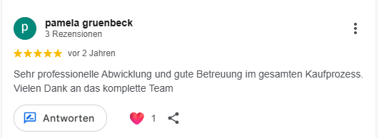

#### Visible-text transcription

- Content type: Google review screenshot

- Reviewer: pamela gruenbeck

- Profile context: 3 Rezensionen

- Rating: 5/5

- Relative date: vor 2 Jahren

> Sehr professionelle Abwicklung und gute Betreuung im gesamten Kaufprozess. Vielen Dank an das komplette Team

### Embedded image 13

- Package source: `word/media/image20.png`

- SHA-256: `909eea30b8264afa81312a5eb604a7b656a3d30f05f78f0d37686ecc67080d1d`

- Size: 14753 bytes; 521x232 px

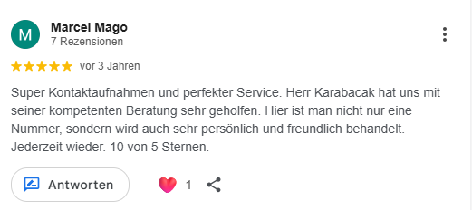

#### Visible-text transcription

- Content type: Google review screenshot

- Reviewer: Marcel Mago

- Profile context: 7 Rezensionen

- Rating: 5/5

- Relative date: vor 3 Jahren

> Super Kontaktaufnahmen und perfekter Service. Herr Karabacak hat uns mit seiner kompetenten Beratung sehr geholfen. Hier ist man nicht nur eine Nummer, sondern wird auch sehr persönlich und freundlich behandelt. Jederzeit wieder. 10 von 5 Sternen.

### Embedded image 14

- Package source: `word/media/image21.png`

- SHA-256: `e5d502414c4a570da152e03bc2647f2309ab1f0fd6612b7651774fefa50bc49f`

- Size: 65998 bytes; 522x749 px

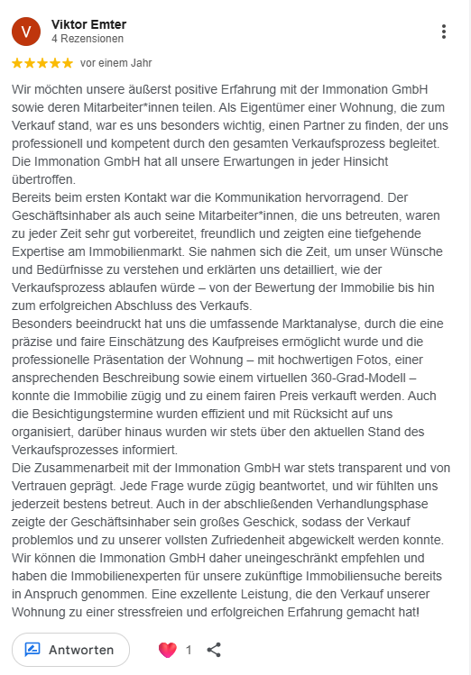

#### Visible-text transcription

- Content type: Google review screenshot

- Reviewer: Viktor Emter

- Profile context: 4 Rezensionen

- Rating: 5/5

- Relative date: vor einem Jahr

> Wir möchten unsere äußerst positive Erfahrung mit der Immonation GmbH sowie deren Mitarbeiter*innen teilen. Als Eigentümer einer Wohnung, die zum Verkauf stand, war es uns besonders wichtig, einen Partner zu finden, der uns professionell und kompetent durch den gesamten Verkaufsprozess begleitet. Die Immonation GmbH hat all unsere Erwartungen in jeder Hinsicht übertroffen.
> Bereits beim ersten Kontakt war die Kommunikation hervorragend. Der Geschäftsinhaber als auch seine Mitarbeiter*innen, die uns betreuten, waren zu jeder Zeit sehr gut vorbereitet, freundlich und zeigten eine tiefgehende Expertise am Immobilienmarkt. Sie nahmen sich die Zeit, um unser Wünsche und Bedürfnisse zu verstehen und erklärten uns detailliert, wie der Verkaufsprozess ablaufen würde – von der Bewertung der Immobilie bis hin zum erfolgreichen Abschluss des Verkaufs.
> Besonders beeindruckt hat uns die umfassende Marktanalyse, durch die eine präzise und faire Einschätzung des Kaufpreises ermöglicht wurde und die professionelle Präsentation der Wohnung – mit hochwertigen Fotos, einer ansprechenden Beschreibung sowie einem virtuellen 360-Grad-Modell – konnte die Immobilie zügig und zu einem fairen Preis verkauft werden. Auch die Besichtigungstermine wurden effizient und mit Rücksicht auf uns organisiert, darüber hinaus wurden wir stets über den aktuellen Stand des Verkaufsprozesses informiert.
> Die Zusammenarbeit mit der Immonation GmbH war stets transparent und von Vertrauen geprägt. Jede Frage wurde zügig beantwortet, und wir fühlten uns jederzeit bestens betreut. Auch in der abschließenden Verhandlungsphase zeigte der Geschäftsinhaber sein großes Geschick, sodass der Verkauf problemlos und zu unserer vollsten Zufriedenheit abgewickelt werden konnte.
> Wir können die Immonation GmbH daher uneingeschränkt empfehlen und haben die Immobilienexperten für unsere zukünftige Immobiliensuche bereits in Anspruch genommen. Eine exzellente Leistung, die den Verkauf unserer Wohnung zu einer stressfreien und erfolgreichen Erfahrung gemacht hat!

### Embedded image 15

- Package source: `word/media/image3.png`

- SHA-256: `7725a08753f62d083f7bbb78f9bb64ea4cf86c31eb72b170a7810edaa3cbff3e`

- Size: 22770 bytes; 521x294 px

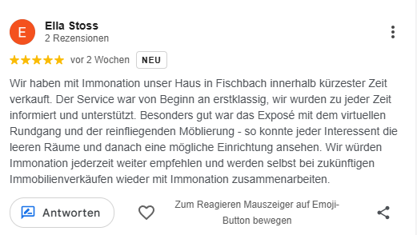

#### Visible-text transcription

- Content type: Google review screenshot

- Reviewer: Ella Stoss

- Profile context: 2 Rezensionen

- Rating: 5/5

- Relative date: vor 2 Wochen

- Visible badge: NEU

> Wir haben mit Immonation unser Haus in Fischbach innerhalb kürzester Zeit verkauft. Der Service war von Beginn an erstklassig, wir wurden zu jeder Zeit informiert und unterstützt. Besonders gut war das Exposé mit dem virtuellen Rundgang und der reinfliegenden Möblierung - so konnte jeder Interessent die leeren Räume und danach eine mögliche Einrichtung ansehen. Wir würden Immonation jederzeit weiter empfehlen und werden selbst bei zukünftigen Immobilienverkäufen wieder mit Immonation zusammenarbeiten.

### Embedded image 16

- Package source: `word/media/image4.png`

- SHA-256: `79d7de2b03b83501248e2bd584b300a1f241ba582a08b251850c77f3d5061275`

- Size: 39534 bytes; 508x533 px

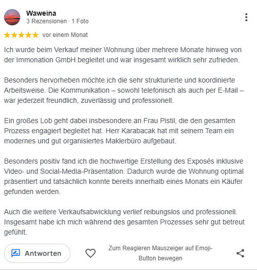

#### Visible-text transcription

- Content type: Google review screenshot

- Reviewer: Waweina

- Profile context: 3 Rezensionen · 1 Foto

- Rating: 5/5

- Relative date: vor einem Monat

> Ich wurde beim Verkauf meiner Wohnung über mehrere Monate hinweg von der Immonation GmbH begleitet und war insgesamt wirklich sehr zufrieden.
>
> Besonders hervorheben möchte ich die sehr strukturierte und koordinierte Arbeitsweise. Die Kommunikation – sowohl telefonisch als auch per E-Mail – war jederzeit freundlich, zuverlässig und professionell.
>
> Ein großes Lob geht dabei insbesondere an Frau Pistil, die den gesamten Prozess engagiert begleitet hat. Herr Karabacak hat mit seinem Team ein modernes und gut organisiertes Maklerbüro aufgebaut.
>
> Besonders positiv fand ich die hochwertige Erstellung des Exposés inklusive Video- und Social-Media-Präsentation. Dadurch wurde die Wohnung optimal präsentiert und tatsächlich konnte bereits innerhalb eines Monats ein Käufer gefunden werden.
>
> Auch die weitere Verkaufsabwicklung verlief reibungslos und professionell. Insgesamt habe ich mich während des gesamten Prozesses sehr gut betreut gefühlt.

### Embedded image 17

- Package source: `word/media/image5.png`

- SHA-256: `8722758d84b4a1a00c514568dcaa8eec0dd28b5afc095efc22d4385b6185ae8e`

- Size: 22332 bytes; 511x286 px

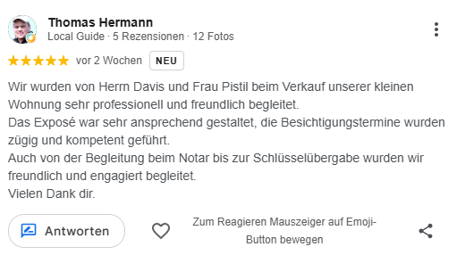

#### Visible-text transcription

- Content type: Google review screenshot

- Reviewer: Thomas Hermann

- Profile context: Local Guide · 5 Rezensionen · 12 Fotos

- Rating: 5/5

- Relative date: vor 2 Wochen

- Visible badge: NEU

> Wir wurden von Herrn Davis und Frau Pistil beim Verkauf unserer kleinen Wohnung sehr professionell und freundlich begleitet.
> Das Exposé war sehr ansprechend gestaltet, die Besichtigungstermine wurden zügig und kompetent geführt.
> Auch von der Begleitung beim Notar bis zur Schlüsselübergabe wurden wir freundlich und engagiert begleitet.
> Vielen Dank dir.

### Embedded image 18

- Package source: `word/media/image6.png`

- SHA-256: `84f36f7c5169edf7e1024769d4803665289a186ea53c6f4ddeb60ff0e4221c00`

- Size: 24797 bytes; 509x204 px

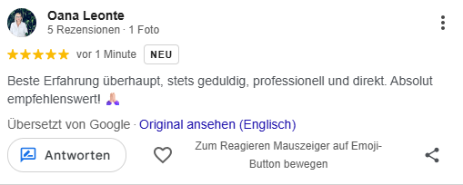

#### Visible-text transcription

- Content type: Google review screenshot

- Reviewer: Oana Leonte

- Profile context: 5 Rezensionen · 1 Foto

- Rating: 5/5

- Relative date: vor 1 Minute

- Visible badge: NEU

> Beste Erfahrung überhaupt, stets geduldig, professionell und direkt. Absolut empfehlenswert! 🙏

- Note: The screenshot says 'Übersetzt von Google' and offers 'Original ansehen (Englisch)'.

### Embedded image 19

- Package source: `word/media/image7.png`

- SHA-256: `a11262c48a00975252ab51178ba22ba53bbc9f94d12b8c77f386c38d38f63735`

- Size: 11728 bytes; 523x190 px

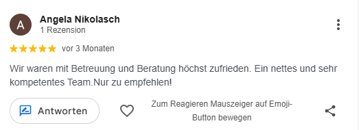

#### Visible-text transcription

- Content type: Google review screenshot

- Reviewer: Angela Nikolasch

- Profile context: 1 Rezension

- Rating: 5/5

- Relative date: vor 3 Monaten

> Wir waren mit Betreuung und Beratung höchst zufrieden. Ein nettes und sehr kompetentes Team.Nur zu empfehlen!

### Embedded image 20

- Package source: `word/media/image8.png`

- SHA-256: `de85fac72f2520ac01467dde70eb6d479da19e921a1f560922f1a58004a73dc9`

- Size: 23738 bytes; 518x315 px

#### Visible-text transcription

- Content type: Google review screenshot

- Reviewer: Markus Burkhardt

- Profile context: 1 Rezension

- Rating: 5/5

- Relative date: vor 7 Monaten

> Vielen Dank für die hervorragende Unterstützung beim Verkauf meiner Eigentumswohnung. Herr Karabacak, Frau Pistil und das ganze Team haben meine Erwartungen mehr als übertroffen. Hier sind echte Profis am Werk. Der Verkaufsprozess ging sehr schnell und reibungslos. Ich wurde stets zeitnah über alle Schritte informiert. Große Expertise, exzellenter und überaus freundlicher Service sowie eine erstklassige Betreuung wurden mir stets entgegengebracht. Ich kann dieses Team mit allerbestem Gewissen nur weiterempfehlen.

### Embedded image 21

- Package source: `word/media/image9.png`

- SHA-256: `4b5a7a19722b23b5cbd3f55f5ea7bc0f4e2d2c1c76febf5ce374298a562c6bee`

- Size: 13278 bytes; 527x189 px

#### Visible-text transcription

- Content type: Google review screenshot

- Reviewer: Hube Hube

- Profile context: 8 Rezensionen · 5 Fotos

- Rating: 5/5

- Relative date: vor 8 Monaten

> Ein engagierter Makler, der moderne Wege wie Social Media nutzt und mit kompetenter Beratung stets beste Ergebnisse für seine Kunden erzielt. 👌🏻👍🏻
