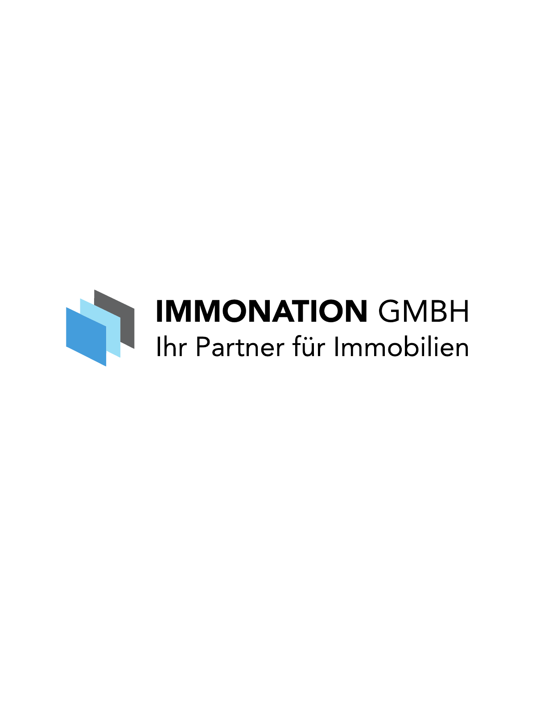

# LOGO Vektor

> Supplied customer source. Treat claims and copy as unapproved until verified.

## Page 1

[No extractable text on this page; the rendered page above preserves the visual/vector content.]

## Visual-only content transcription

- Content type: Vector brand logo

- Visible text: IMMONATION GMBH; Ihr Partner für Immobilien

- Visual description: Immonation lockup with a layered blue, light-blue, and gray geometric mark to the left of the company name and tagline.
