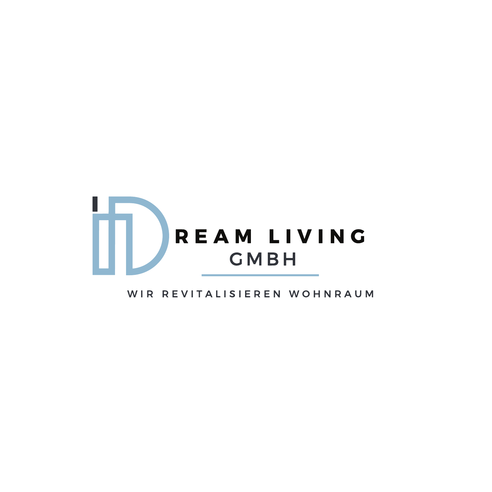

# Logo3

> Supplied customer source. Treat claims and copy as unapproved until verified.

## Page 1

[No extractable text on this page; the rendered page above preserves the visual/vector content.]

## Visual-only content transcription

- Content type: Vector brand logo

- Visible text: DREAM LIVING GMBH; WIR REVITALISIEREN WOHNRAUM

- Visual description: Dream Living lockup with an outlined light-blue monogram, black and charcoal wordmark, and a horizontal light-blue rule above the tagline.
