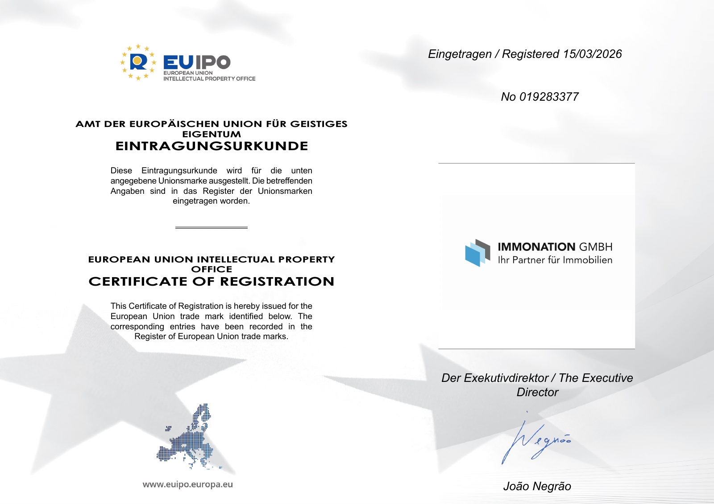
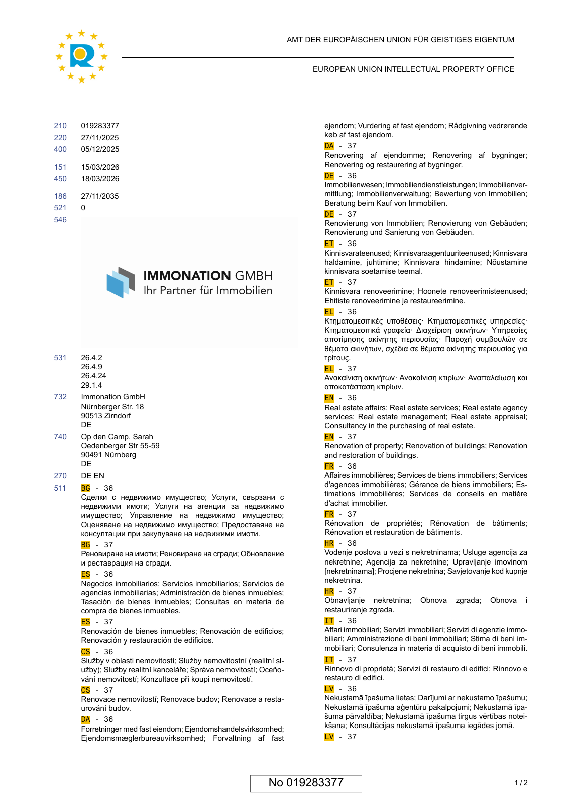
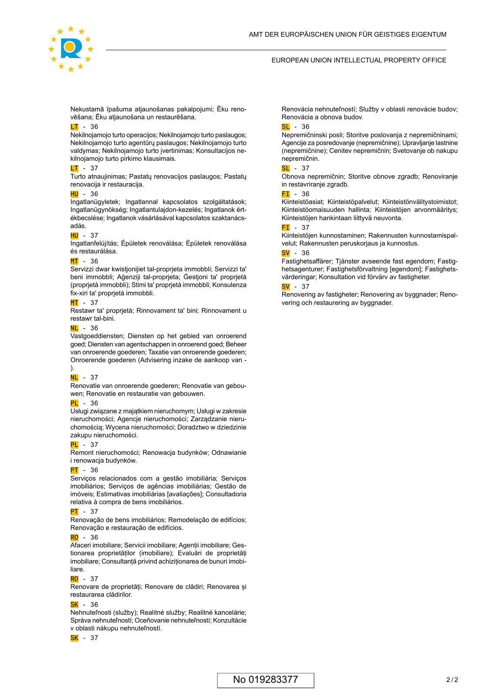

# Zertifikat Marke Immonation

> Supplied customer source. Treat claims and copy as unapproved until verified.

## Page 1

AMT DER EUROPÄISCHEN UNION FÜR GEISTIGES
EIGENTUM
EINTRAGUNGSURKUNDE
Diese Eintragungsurkunde wird für die unten
angegebene Unionsmarke ausgestellt. Die betreffenden
Angaben sind in das Register der Unionsmarken
eingetragen worden.
EUROPEAN UNION INTELLECTUAL PROPERTY
OFFICE
CERTIFICATE OF REGISTRATION
This Certificate of Registration is hereby issued for the
European Union trade mark identified below. The
corresponding entries have been recorded in the
Register of European Union trade marks.
Eingetragen / Registered 15/03/2026
No 019283377
Der Exekutivdirektor / The Executive
Director
João Negrão

## Page 2

019283377210
27/11/2025220
05/12/2025400
15/03/2026151
18/03/2026450
27/11/2035186
0521
546
26.4.2531
26.4.9
26.4.24
29.1.4
Immonation GmbH732
Nürnberger Str. 18
90513 Zirndorf
DE
Op den Camp, Sarah740
Oedenberger Str 55-59
90491 Nürnberg
DE
DE EN270
BG - 36
Сделки с недвижимо имущество; Услуги, свързани с
недвижими имоти; Услуги на агенции за недвижимо
511
имущество; Управление на недвижимо имущество;
Оценяване на недвижимо имущество; Предоставяне на
консултации при закупуване на недвижими имоти.
BG - 37
Реновиране на имоти; Реновиране на сгради; Обновление
и реставрация на сгради.
ES - 36
Negocios inmobiliarios; Servicios inmobiliarios; Servicios de
agencias inmobiliarias; Administración de bienes inmuebles;
Tasación de bienes inmuebles; Consultas en materia de
compra de bienes inmuebles.
ES - 37
Renovación de bienes inmuebles; Renovación de edificios;
Renovación y restauración de edificios.
CS - 36
Služby v oblasti nemovitostí; Služby nemovitostní (realitní sl-
užby); Služby realitní kanceláře; Správa nemovitostí; Oceňo-
vání nemovitostí; Konzultace při koupi nemovitostí.
CS - 37
Renovace nemovitostí; Renovace budov; Renovace a resta-
urování budov.
DA - 36
Forretninger med fast eiendom; Ejendomshandelsvirksomhed;
Ejendomsmæglerbureauvirksomhed; Forvaltning af fast
ejendom; Vurdering af fast ejendom; Rådgivning vedrørende
køb af fast ejendom.
DA - 37
Renovering af ejendomme; Renovering af bygninger;
Renovering og restaurering af bygninger.
DE - 36
Immobilienwesen; Immobiliendienstleistungen; Immobilienver-
mittlung; Immobilienverwaltung; Bewertung von Immobilien;
Beratung beim Kauf von Immobilien.
DE - 37
Renovierung von Immobilien; Renovierung von Gebäuden;
Renovierung und Sanierung von Gebäuden.
ET - 36
Kinnisvarateenused; Kinnisvaraagentuuriteenused; Kinnisvara
haldamine, juhtimine; Kinnisvara hindamine; Nõustamine
kinnisvara soetamise teemal.
ET - 37
Kinnisvara renoveerimine; Hoonete renoveerimisteenused;
Ehitiste renoveerimine ja restaureerimine.
EL - 36
Κτηματομεσιτικές υποθέσεις· Κτηματομεσιτικές υπηρεσίες·
Κτηματομεσιτικά γραφεία· Διαχείριση ακινήτων· Υπηρεσίες
αποτίμησης ακίνητης περιουσίας· Παροχή συμβουλών σε
θέματα ακινήτων, σχέδια σε θέματα ακίνητης περιουσίας για
τρίτους.
EL - 37
Ανακαίνιση ακινήτων· Ανακαίνιση κτιρίων· Αναπαλαίωση και
αποκατάσταση κτιρίων.
EN - 36
Real estate affairs; Real estate services; Real estate agency
services; Real estate management; Real estate appraisal;
Consultancy in the purchasing of real estate.
EN - 37
Renovation of property; Renovation of buildings; Renovation
and restoration of buildings.
FR - 36
Affaires immobilières; Services de biens immobiliers; Services
d'agences immobilières; Gérance de biens immobiliers; Es-
timations immobilières; Services de conseils en matière
d'achat immobilier.
FR - 37
Rénovation de propriétés; Rénovation de bâtiments;
Rénovation et restauration de bâtiments.
HR - 36
Vođenje poslova u vezi s nekretninama; Usluge agencija za
nekretnine; Agencija za nekretnine; Upravljanje imovinom
[nekretninama]; Procjene nekretnina; Savjetovanje kod kupnje
nekretnina.
HR - 37
Obnavljanje nekretnina; Obnova zgrada; Obnova i
restauriranje zgrada.
IT - 36
Affari immobiliari; Servizi immobiliari; Servizi di agenzie immo-
biliari; Amministrazione di beni immobiliari; Stima di beni im-
mobiliari; Consulenza in materia di acquisto di beni immobili.
IT - 37
Rinnovo di proprietà; Servizi di restauro di edifici; Rinnovo e
restauro di edifici.
LV - 36
Nekustamā īpašuma lietas; Darījumi ar nekustamo īpašumu;
Nekustamā īpašuma aģentūru pakalpojumi; Nekustamā īpa-
šuma pārvaldība; Nekustamā īpašuma tirgus vērtības notei-
kšana; Konsultācijas nekustamā īpašuma iegādes jomā.
LV - 37
1/2No 019283377
AMT DER EUROPÄISCHEN UNION FÜR GEISTIGES EIGENTUM
EUROPEAN UNION INTELLECTUAL PROPERTY OFFICE

## Page 3

Nekustamā īpašuma atjaunošanas pakalpojumi; Ēku reno-
vēšana; Ēku atjaunošana un restaurēšana.
LT - 36
Nekilnojamojo turto operacijos; Nekilnojamojo turto paslaugos;
Nekilnojamojo turto agentūrų paslaugos; Nekilnojamojo turto
valdymas; Nekilnojamojo turto įvertinimas; Konsultacijos ne-
kilnojamojo turto pirkimo klausimais.
LT - 37
Turto atnaujinimas; Pastatų renovacijos paslaugos; Pastatų
renovacija ir restauracija.
HU - 36
Ingatlanügyletek; Ingatlannal kapcsolatos szolgáltatások;
Ingatlanügynökség; Ingatlantulajdon-kezelés; Ingatlanok ért-
ékbecslése; Ingatlanok vásárlásával kapcsolatos szaktanács-
adás.
HU - 37
Ingatlanfelújítás; Épületek renoválása; Épületek renoválása
és restaurálása.
MT - 36
Servizzi dwar kwistjonijiet tal-proprjeta immobbli; Servizzi ta'
beni immobbli; Aġenziji tal-proprjeta; Ġestjoni ta' proprjetà
(proprjetà immobbli); Stimi ta' proprjetà immobbli; Konsulenza
fix-xiri ta' proprjetà immobbli.
MT - 37
Restawr ta' proprjetà; Rinnovament ta' bini; Rinnovament u
restawr tal-bini.
NL - 36
Vastgoeddiensten; Diensten op het gebied van onroerend
goed; Diensten van agentschappen in onroerend goed; Beheer
van onroerende goederen; Taxatie van onroerende goederen;
Onroerende goederen (Advisering inzake de aankoop van -
).
NL - 37
Renovatie van onroerende goederen; Renovatie van gebou-
wen; Renovatie en restauratie van gebouwen.
PL - 36
Usługi związane z majątkiem nieruchomym; Usługi w zakresie
nieruchomości; Agencje nieruchomości; Zarządzanie nieru-
chomością; Wycena nieruchomości; Doradztwo w dziedzinie
zakupu nieruchomości.
PL - 37
Remont nieruchomości; Renowacja budynków; Odnawianie
i renowacja budynków.
PT - 36
Serviços relacionados com a gestão imobiliária; Serviços
imobiliários; Serviços de agências imobiliárias; Gestão de
imóveis; Estimativas imobiliárias [avaliações]; Consultadoria
relativa à compra de bens imobiliários.
PT - 37
Renovação de bens imobiliários; Remodelação de edifícios;
Renovação e restauração de edifícios.
RO - 36
Afaceri imobiliare; Servicii imobiliare; Agenții imobiliare; Ges-
tionarea proprietăților (imobiliare); Evaluări de proprietăți
imobiliare; Consultanță privind achiziționarea de bunuri imobi-
liare.
RO - 37
Renovare de proprietăți; Renovare de clădiri; Renovarea și
restaurarea clădirilor.
SK - 36
Nehnuteľnosti (služby); Realitné služby; Realitné kancelárie;
Správa nehnuteľností; Oceňovanie nehnuteľností; Konzultácie
v oblasti nákupu nehnuteľností.
SK - 37
Renovácia nehnuteľností; Služby v oblasti renovácie budov;
Renovácia a obnova budov.
SL - 36
Nepremičninski posli; Storitve poslovanja z nepremičninami;
Agencije za posredovanje (nepremičnine); Upravljanje lastnine
(nepremičnine); Cenitev nepremičnin; Svetovanje ob nakupu
nepremičnin.
SL - 37
Obnova nepremičnin; Storitve obnove zgradb; Renoviranje
in restavriranje zgradb.
FI - 36
Kiinteistöasiat; Kiinteistöpalvelut; Kiinteistönvälitystoimistot;
Kiinteistöomaisuuden hallinta; Kiinteistöjen arvonmääritys;
Kiinteistöjen hankintaan liittyvä neuvonta.
FI - 37
Kiinteistöjen kunnostaminen; Rakennusten kunnostamispal-
velut; Rakennusten peruskorjaus ja kunnostus.
SV - 36
Fastighetsaffärer; Tjänster avseende fast egendom; Fastig-
hetsagenturer; Fastighetsförvaltning [egendom]; Fastighets-
värderingar; Konsultation vid förvärv av fastigheter.
SV - 37
Renovering av fastigheter; Renovering av byggnader; Reno-
vering och restaurering av byggnader.
2/2No 019283377
AMT DER EUROPÄISCHEN UNION FÜR GEISTIGES EIGENTUM
EUROPEAN UNION INTELLECTUAL PROPERTY OFFICE
